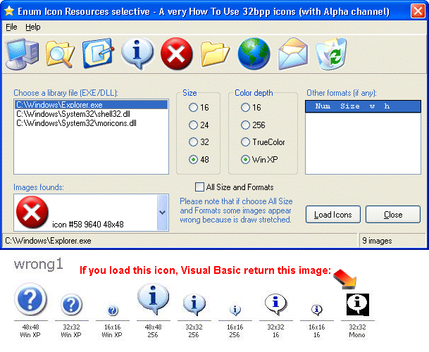



## Enumerate Icon Resources

### Description

A 'VERY' How To Use Windows XP icons (32bpp with Alpha channel) from Visual Basic. The VB 'standard' methods not allow to use this icons, and reject them with "Invalid image" error message. This code show (using advanced of API) how to load this icon types. Not only! You can choose 'which' image format and size to load from icon file.
 
### More Info
 
A 'VERY' How To Use Windows XP icons (32bpp with Alpha channel) from Visual Basic. The VB 'standard' methods not allow to use this icons, and reject them with "Invalid image" error message. This code show (using advanced of API) how to load this icon types. Not only! You can choose 'which' image format and size to load from icon file.

Therefore you can load 16x16 or 24x24 or 32x32 or 48x48 image formats on 16, 256, TrueColor or Windows XP colors Alpha channel!

Also, this project explain how to create DLL libraries containing Windows XP icons (Resource Editor not allow neither this!).

The screenshot explain better.

Due to PSC don't allow to include DLL, I have leave out 4 DLL with Windows XP icons. If you want, download them from my web site.

Enjoy

             |
---                |---
**Submitted On**   |2004-04-04 12:47:02
**By**             |[gibra](https://github.com/Planet-Source-Code/PSCIndex/blob/master/ByAuthor/gibra.md)
**Level**          |Advanced
**User Rating**    |4.9 (39 globes from 8 users)
**Compatibility**  |VB 6\.0
**Category**       |[Graphics](https://github.com/Planet-Source-Code/PSCIndex/blob/master/ByCategory/graphics__1-46.md)
**World**          |[Visual Basic](https://github.com/Planet-Source-Code/PSCIndex/blob/master/ByWorld/visual-basic.md)
**Archive File**   |[Enumerate\_172850442004\.zip](https://github.com/Planet-Source-Code/gibra-enumerate-icon-resources__1-52863/archive/master.zip)

